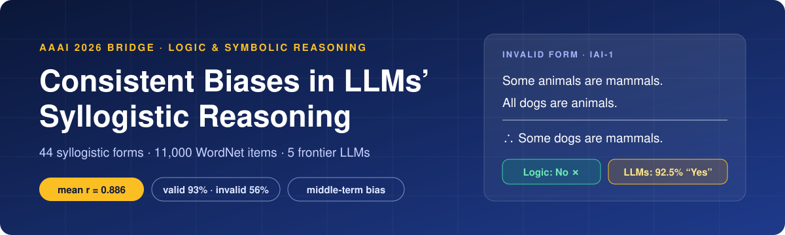
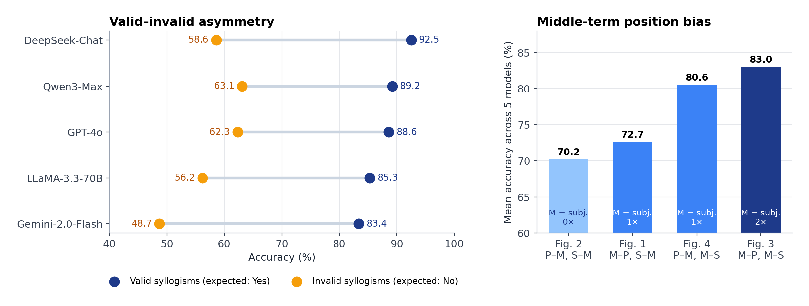
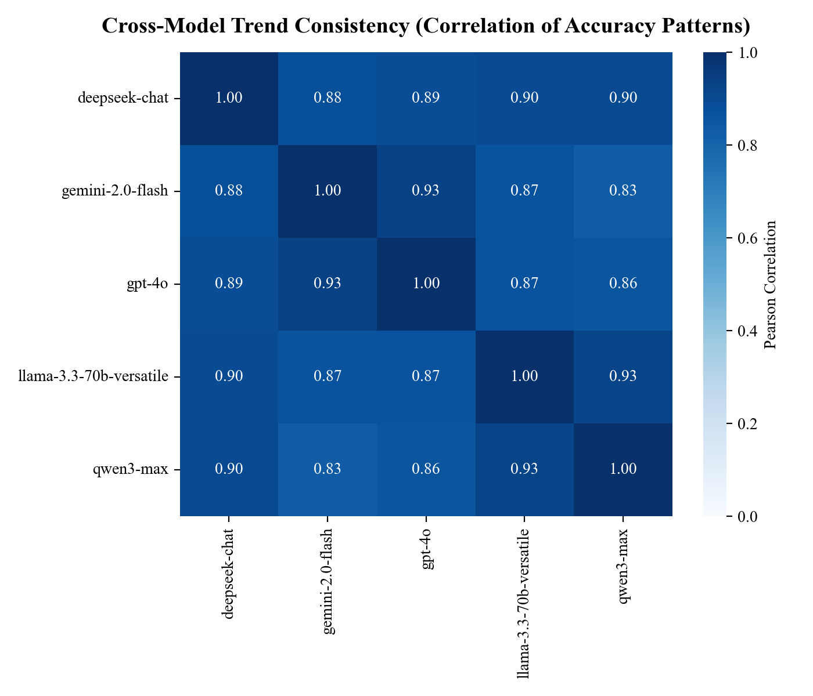
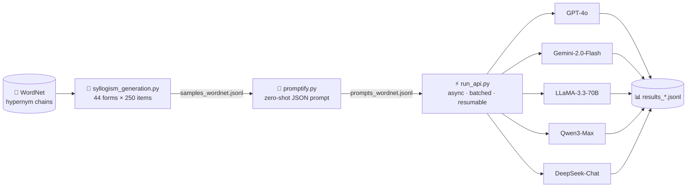

<div align="center">



<br>

[](Paper.pdf)
[](#-citation)
[](requirements.txt)
[](https://github.com/limengge426/llm-syllogism/stargazers)

**Limeng Ge** · East China Normal University, Department of Philosophy

*Do LLMs actually reason, or do they just sound like they do?*
<br>
We test five frontier models on **all 44 classical syllogisms** and find that they fail in the **same places, for the same reasons**.

[📄 Paper](Paper.pdf) · [🔍 Findings](#-key-findings) · [🧪 Benchmark](#-the-benchmark) · [🚀 Quick Start](#-quick-start) · [📚 Citation](#-citation)

</div>

---

## ✨ TL;DR

| | Finding | Evidence |
|:-:|---|---|
| 🔗 | **Different models make the same mistakes.** GPT-4o, Gemini, LLaMA, Qwen and DeepSeek find the same syllogisms easy and the same ones hard. | Mean pairwise Pearson **r = 0.886**; every pair **> 0.83** |
| ⚖️ | **Models say "Yes" too easily.** They accept valid conclusions but often fail to reject invalid ones. | Valid **93%** vs. invalid **56%** accuracy |
| 📍 | **The position of the middle term matters.** Accuracy goes up with the number of premises where the middle term is the grammatical subject. | Figure 3 **83.0%** → Figure 2 **70.2%** |

Taken together, these results suggest that LLMs pick up **surface regularities of language** rather than the **logical structure** of an argument, and that this bias is shared across architectures rather than specific to one model.

## 🔍 Key Findings

<p align="center">
  
</p>

<table>
<tr>
<td width="50%" valign="top">

### 🔗 Cross-model consistency

We flatten each model's accuracy on the 44 forms into a single vector and correlate the vectors across models. Despite different architectures, scales and training data, the models' difficulty profiles are **nearly identical**.

</td>
<td width="50%">

</td>
</tr>
</table>

### 📍 Middle-term bias

The four **Figures** of a syllogism differ only in where the middle term **M** appears. Accuracy follows how often M is the grammatical subject:

| Figure | Premise pattern | M as subject | Mean accuracy |
|:-:|:-:|:-:|:-:|
| **3** | M–P, M–S | 2× | **83.0%** 🥇 |
| **4** | P–M, M–S | 1× | 80.6% |
| **1** | M–P, S–M | 1× | 72.7% |
| **2** | P–M, S–M | 0× | 70.2% |

A likely explanation is that "M → P, M → S" matches the dominant forward-entailment pattern of natural language, while reversed chains are rarer in training text.

### ⚖️ Valid–invalid asymmetry

| Model | Overall | ✅ Valid | ❌ Invalid | Gap |
|---|:-:|:-:|:-:|:-:|
| DeepSeek-Chat | **84.0** | 92.5 | 58.6 | 33.9 |
| Qwen3-Max | 81.8 | 89.2 | **63.1** | 26.1 |
| GPT-4o | 75.4 | 88.6 | 62.3 | 26.3 |
| LLaMA-3.3-70B | 71.8 | 85.3 | 56.2 | 29.1 |
| Gemini-2.0-Flash | 69.9 | 83.4 | 48.7 | 34.7 |

The worst case is **IAI-1**: *"Some animals are mammals. All dogs are animals. ∴ Some dogs are mammals."* The conclusion sounds right but does not follow from the premises, and **all five models accept it more than 84% of the time.** This mirrors the *atmosphere effect* and *belief bias* documented in human reasoning.

<details>
<summary><b>📊 Full accuracy table: 5 models × 44 forms (click to expand)</b></summary>

<br>

See **Table 4** in the [paper](Paper.pdf). Columns are moods (AAA … OAO); rows are Figures 1–4 per model. Cells marked as invalid there are the forms where the correct answer is **No**.

</details>

## 🧪 The Benchmark

### Syllogisms in 30 seconds

Each statement is one of four categorical types:

| Type | Form | Name |
|:-:|---|---|
| **A** | All S are P | Universal affirmative |
| **E** | No S are P | Universal negative |
| **I** | Some S are P | Particular affirmative |
| **O** | Some S are not P | Particular negative |

A **Mood** (e.g. `AAA`) sets the types of the two premises and the conclusion. A **Figure** (1–4) sets where the middle term goes. 4 Figures × 16 Moods gives 64 forms. We test **24 valid** forms and **20 invalid** ones, **44 in total**.

### Task: Conclusion Correctness Verification

Given two premises and a conclusion, does the conclusion follow? Models answer zero-shot, with no chain-of-thought, so we measure their default intuitive reasoning.

```text
Consider the context:
- All bovid are ruminant.
- All sheep are bovid.

Is the conclusion correct GIVEN the context?
Conclusion: All sheep are ruminant.

Return ONLY the following JSON object (no code fences, no extra text):
{"valid":"Yes" or "No","why":"One short sentence"}
```

### Built from WordNet

The subject (S), middle (M) and predicate (P) terms are sampled from **WordNet hyponym → hypernym chains** (e.g. `sheep → bovid → ruminant`). This keeps every term non-empty and every sentence natural, while the **logical form** stays the only variable.

| | Forms | Items per form | Items | Expected answer |
|---|:-:|:-:|:-:|:-:|
| Validity test | 24 | 250 | 6,000 | Yes |
| Invalidity test | 20 | 250 | 5,000 | No |
| **Total** | **44** | | **11,000** | |

## ⚙️ Pipeline



- **Offline WordNet**: bundled under `vendor/`, so no NLTK download is needed.
- **Concurrent querying**: `asyncio` + the OpenAI-compatible async client, with per-model concurrency limits (8–20 workers) and batching.
- **Robust**: exponential backoff on rate limits, retries, and a raw-text fallback when a model returns invalid JSON.
- **Resumable**: already-answered item IDs are skipped, so an interrupted run continues where it stopped.

## 🚀 Quick Start

**1. Install**

```bash
git clone https://github.com/limengge426/llm-syllogism.git
cd llm-syllogism
pip install -r requirements.txt
```

**2. Generate the 11,000-item benchmark** → `data/samples_wordnet.jsonl`

```bash
python scripts/syllogism_generation.py
```

**3. Turn items into prompts** → `data/prompts_wordnet.jsonl`

```bash
python scripts/promptify.py
```

**4. Add API keys.** Copy the template and fill in only the models you want. Models without a key are skipped.

```bash
cp .env.example .env
```

**5. Query the models** → `data/results_<model>.jsonl`

```bash
python scripts/run_api.py
```

<details>
<summary><b>📁 Data format</b></summary>

<br>

Each benchmark item (`samples_wordnet.jsonl`):

```json
{
  "id": "AAA-1_WordNet_274447_validity",
  "figure": 1,
  "mood": "AAA",
  "context": ["All bovid are ruminant.", "All sheep are bovid."],
  "fact": "All sheep are ruminant.",
  "placeholders": {"S": "sheep", "M": "bovid", "P": "ruminant"},
  "type": "validity",
  "expected_answer": "Yes"
}
```

`type` is `validity` (expected **Yes**) or `fallacy` (the invalidity test, expected **No**). Each result line adds `model` and `reply: {"valid": ..., "why": ...}`.

</details>

## 🗂️ Repository Structure

```text
llm-syllogism/
├── Paper.pdf                       # AAAI 2026 Bridge paper
├── scripts/
│   ├── syllogism_generation.py     # WordNet → 44 forms × 250 items
│   ├── promptify.py                # items → zero-shot prompts
│   └── run_api.py                  # async multi-model querying
├── vendor/corpora/wordnet/         # bundled WordNet 3.0
├── assets/                         # README figures
├── .env.example                    # API key template
└── requirements.txt
```

## 🔭 Open Questions

- Does **chain-of-thought** prompting remove the middle-term bias, or only hide it?
- Do humans and LLMs share **representational mechanisms**, or only produce the same behavior?
- Do these syntactic biases extend to **generalized quantifiers** and richer natural logic?

## 📚 Citation

If you find this work useful, please consider citing it and giving the repo a ⭐.

```bibtex
@inproceedings{ge2026consistent,
  title     = {Consistent Biases in Large Language Models' Syllogistic Reasoning},
  author    = {Ge, Limeng},
  booktitle = {AAAI 2026 Bridge Program: Logical and Symbolic Reasoning in Language Models},
  year      = {2026},
  url       = {https://github.com/limengge426/llm-syllogism}
}
```

<div align="center">
<sub>WordNet © Princeton University, used under the <a href="https://wordnet.princeton.edu/license-and-commercial-use">WordNet 3.0 license</a>.</sub>
</div>
